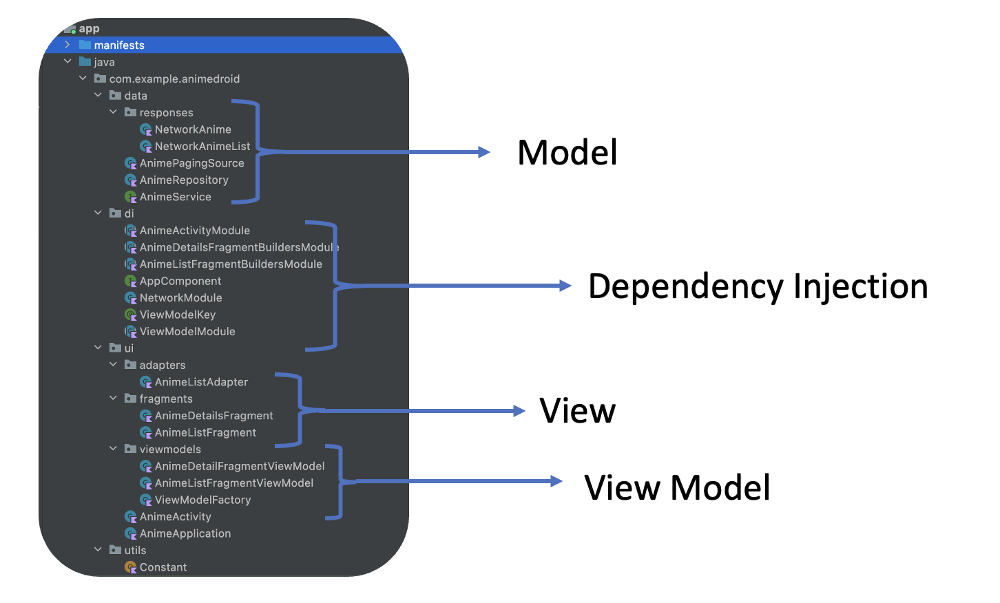

# AnimeDroid 

## **Demo:**
| Anime List Shimmer Load                                | Anime List infinite Scroll                       | Anime Details                                        |
|--------------------------------------------------------|--------------------------------------------------|------------------------------------------------------|
|  |  |  |

## **Architecture:**

**Single-Activity Architecture**  - Coming soon

**Model-View-ViewModel** - Coming soon

## **Package Structure:**



## **Dependency Graph:**

**Diagram coming soon**

## **Branches And Related Pull Requests:**

| Branch Name                   | Related Pull Request                           | Description                                                     |
|-------------------------------|------------------------------------------------|-----------------------------------------------------------------|
| addPaging                     | https://github.com/jamesdpli/AnimeDroid/pull/4 | Anime list is now paged                                         |                                                                 |
| addShimmerToRecyclerView      | https://github.com/jamesdpli/AnimeDroid/pull/8 | Adds shimmer to recycler view, instead of circular progress bar |
| addDaggerAndroid              | https://github.com/jamesdpli/AnimeDroid/pull/2 | Add Dagger-Android                                              |                                                                 |
| baseRecyclerViewExample       | N/A                                            | Plain old recycler view                                         |
| clickListenerUpdate           | https://github.com/jamesdpli/AnimeDroid/pull/1 | Add click listener to recycler view items                       |
| completeShimmerImplementation | https://github.com/jamesdpli/AnimeDroid/pull/9 | Replace circular progress bar with shimmer animations           |
| passingDataWithBundle         | N/A                                            | Pass data with bundle rather than safe args                     |
| showLoadingStateInUi          | https://github.com/jamesdpli/AnimeDroid/pull/7 | Adds Circular spinners to show load state                       |
| styleUpdate                   | https://github.com/jamesdpli/AnimeDroid/pull/6 | Basic update to xml                                             |
| updateDaggerImplementation    | https://github.com/jamesdpli/AnimeDroid/pull/3 | Makes use of DaggerFragment, DaggerAppCompatActivity etc        |

## **Libraries used:**

- [Jetpack](https://developer.android.com/jetpack)
    - [Android KTX](https://developer.android.com/kotlin/ktx.html)
    - [AndroidX](https://developer.android.com/jetpack/androidx)
    - [ViewBinding](https://developer.android.com/topic/libraries/view-binding)
    - [Navigation](https://developer.android.com/jetpack/androidx/releases/navigation)
    - [Lifecycle](https://developer.android.com/topic/libraries/architecture/lifecycle)
    - [ViewModel](https://developer.android.com/topic/libraries/architecture/viewmodel)
    - [Paging3](https://developer.android.com/topic/libraries/architecture/paging/v3-overview)
    - [RecyclerView](https://developer.android.com/reference/androidx/recyclerview/widget/RecyclerView)
- [Dagger Android](https://dagger.dev/dev-guide/android.html)
- [Retrofit](https://square.github.io/retrofit/)
- [Coroutines](https://github.com/Kotlin/kotlinx.coroutines)
- [Flow](https://developer.android.com/kotlin/flow)
- [Material Design](https://material.io/develop/android/docs/getting-started/)
- [Coil](https://github.com/coil-kt/coil)
- [Shimmer](https://facebook.github.io/shimmer-android/)

## **Credits**

| Credits | Description                                                                                                                                                                                                            | Link To Docs                   |
|---------|------------------------------------------------------------------------------------------------------------------------------------------------------------------------------------------------------------------------|--------------------------------|
| Kitsu   | Kitsu is a modern anime discovery platform that helps you track the anime you're watching, discover new anime and socialize with other fans. With the Kitsu API you can do everything the client can do and much more. | https://kitsu.docs.apiary.io/# | 

```
Copyright 2023 James Dudhi-Price

Licensed under the Apache License, Version 2.0 (the "License");
you may not use this file except in compliance with the License.
You may obtain a copy of the License at

    http://www.apache.org/licenses/LICENSE-2.0

Unless required by applicable law or agreed to in writing, software
distributed under the License is distributed on an "AS IS" BASIS,
WITHOUT WARRANTIES OR CONDITIONS OF ANY KIND, either express or implied.
See the License for the specific language governing permissions and
limitations under the License.
```
